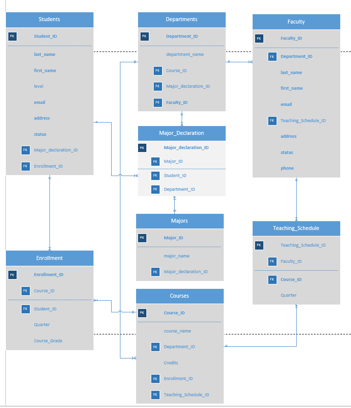

# School SQL/Data Modeling exercise

###### Prompt/Details:

Develop a data model for a university that can handle all data related to students, faculty, courses etc.

* [X] In particular it needs to support the following:

1. [X] List of all students
2. [X] List of all courses
3. [X] List of all semesters
4. [X] List of all departments
5. [X] List of all majors
6. [X] List of all faculty

* [X] Relationships between them

List all courses faculty person A has taught

1. [X] ``sql

   SELECT *
   FROM Teaching_Schedule
   WHERE Faculty_ID = 'A';

   -- Could also left Inner/left join Faculty table with this table Teaching_Sched

* [X] List all courses student B has taken together  with grade/completion rate

SELECT * FROM Enrollment WHERE Student_ID = 'B';

* [X] Solution diagram

Write SQL queries to answer the following:

* [X] *See: question_1.sql*: Compute the pass rate for each course last semester and order them by pass rate descending
* [X] *See: question_2.sql* : For all students in their fourth year, check if they have taken courses worth of 20 credits in the department associated with their major
* [X] *See: question_3.sql:* Write a query that enrolls a student in a class

# Solution

## Diagram

## Entities and relations

1. Students:
   * 1 to many with major declaration (for double majoring students)
   * 1 to many with enrollment (for students taking multiple classes)
2. Faculty
   * Many to 1 with departments
   * 1 to many with teaching schedule
3. Teaching_schedule
   * Breaks the many to many (4NF) relation between Faculty and Courses
   * many to one relation with faculty
   * many to one relation with courses
4. Courses
   * 1 to many relation with teching schedule
   * 1 to many relation with enrollment
5. Enrollment.
   * Attributes **Course_ID**, Student_ID and Quarter.
   * Many to one relationship with Courses and Students.
   * Breaks the many to many relations(4NF) between Courses and Students.
6. Majors
   * 1 to many relation with major delaration
7. Major declaration
   * Breaks the many to many relations(4NF) between Majors, Departments and Students.
   * many to 1 relation with majors, departments and students.
8. Departments
   * 1 to many relation with major declaration

## Data

* Created DB and tables using `./sql/create_db_and_table.sql`
* Inserted some data into the students table using `./sql/data_insrts.sql`
* Connected to the DB using `./code/connect.py`
* In directory `./sql`there are files: `question_1.sql, question_2.sql, and question_3.sql` which have the solutions for the last 3 questions.

## Corrections

* Majors should be directly related to Departments.
* A Many to one relation, Major to Department.
* Enables changes(adds/removals) to departments to be easily integrated with Majors table.
